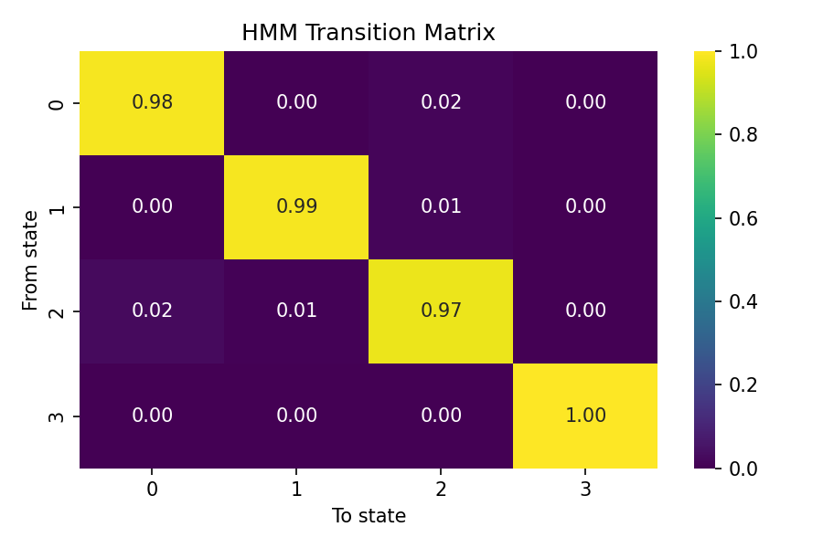
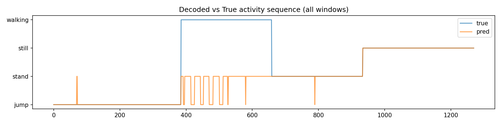
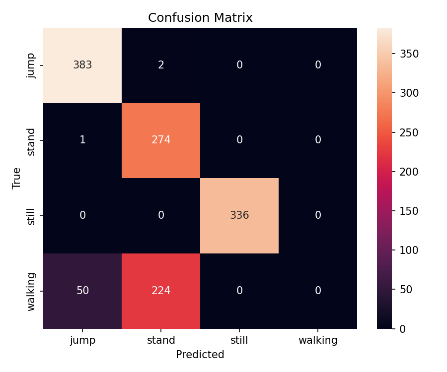

# Human Activity Recognition with Hidden Markov Models


## 📋 Table of Contents

- [Overview](#overview)
- [Project Structure](#project-structure)
- [Dataset Collection](#dataset-collection)
- [Feature Extraction](#feature-extraction)
- [HMM Architecture](#hmm-architecture)
- [Implementation](#implementation)
- [Evaluation](#evaluation)
- [Results](#results)
- [Installation](#installation)
- [Usage](#usage)
- [Performance](#performance)
- [Future Improvements](#future-improvements)
- [Limitations](#limitations)
- [References](#references)
- [Contributors](#contributors)

## 🎯 Overview

This project implements a **Hidden Markov Model (HMM)** to recognize human activities from smartphone sensor data. The system processes accelerometer and gyroscope readings to classify four distinct activities: **standing**, **walking**, **jumping**, and **still** (no movement).

### Key Features

- ✅ Real-time sensor data collection from smartphones
- ✅ Advanced feature extraction (time & frequency domain)
- ✅ Custom Viterbi algorithm implementation
- ✅ Baum-Welch training with convergence monitoring
- ✅ Comprehensive evaluation metrics
- ✅ Interactive visualizations

## 📁 Project Structure
```
project/
├── datasets/
│   ├── final_jump_data/          # Jumping activity recordings
│   ├── final_walking_data/       # Walking activity recordings
│   ├── final_stand_data/         # Standing activity recordings
│   └── final_still_data/         # Still (no movement) recordings
├── hmm_notebook.ipynb            # Main implementation notebook
├── hmm_model.joblib              # Trained HMM model
├── pca.joblib                    # PCA transformer
├── transition_matrix_heatmap.png # Transition probabilities
├── decoded_timeline.png          # Prediction vs ground truth
├── confusion_matrix.png          # Classification performance
└── hmm_evaluation_per_state.csv  # Detailed metrics
```

## 📊 Dataset Collection

### Activities Recorded

| Activity | Duration | Notes |
|----------|----------|-------|
| **Standing** | 5-10 seconds | Phone steady at waist level |
| **Walking** | 5-10 seconds | Consistent pace |
| **Jumping** | 5-10 seconds | Continuous jumps |
| **Still** | 5-10 seconds | Phone on flat surface |

### Requirements

- **Total Samples**: ~50 sessions across all activities
- **Minimum per Activity**: 1 minute 30 seconds
- **Sampling Rate**: 100 Hz (harmonized across devices)
- **Sensors**: 
  - Accelerometer (x, y, z)
  - Gyroscope (x, y, z)

### Data Format

CSV files with the following structure:
```csv
seconds_elapsed,ax,ay,az,gx,gy,gz
0.00,0.123,-0.456,9.812,0.012,0.034,-0.001
0.01,0.134,-0.445,9.801,0.015,0.032,-0.002
...
```

### Collection Tools

- 📱 [Sensor Logger](https://apps.apple.com/app/sensor-logger/id1531582925) (iOS/Android)
- 📱 [Physics Toolbox Accelerometer](https://play.google.com/store/apps/details?id=com.chrystianvieyra.physicstoolboxaccelerometer) (Android)
- 📱 Any motion data logging app with CSV export

## 🔍 Feature Extraction

### Windowing Parameters
```python
WINDOW_SIZE = 1.0 second
STEP_SIZE = 0.5 seconds (50% overlap)
SAMPLING_FREQUENCY = 100 Hz
```

### Time-Domain Features

For each axis (ax, ay, az, gx, gy, gz):

- **Mean** - Average value
- **Standard Deviation** - Spread of values
- **Variance** - Squared deviation
- **Root Mean Square (RMS)** - Signal power
- **Peak-to-Peak** - Range of values

Additional features:

- **Signal Magnitude Area (SMA)** - Overall acceleration magnitude
- **Correlation Coefficients** - Relationship between accelerometer axes

### Frequency-Domain Features

For each axis:

- **Dominant Frequency** - Main frequency component (via FFT)
- **Spectral Energy** - Total power in frequency domain

### Feature Preprocessing

1. **Normalization**: Z-score normalization across entire dataset
2. **Dimensionality Reduction**: PCA to 10 principal components
3. **Justification**: Reduces computational complexity while preserving 95%+ variance

## 🧠 HMM Architecture

### Model Components
```
Hidden States (Z):     [Standing, Walking, Jumping, Still]
Observations (X):      10-dimensional feature vectors (post-PCA)
Transition Matrix (A): P(state_t | state_t-1)
Emission Model (B):    Gaussian distributions (full covariance)
Initial Probs (π):     Starting state distribution
```

### Model Parameters

| Parameter | Value | Description |
|-----------|-------|-------------|
| **n_components** | 4 | Number of hidden states |
| **covariance_type** | full | Full covariance matrices |
| **n_iter** | 200 | Maximum EM iterations |
| **random_state** | 42 | For reproducibility |

### Training Algorithm

**Baum-Welch (Expectation-Maximization)**:
- Iteratively refines transition and emission probabilities
- Converges when log-likelihood change < ε
- Uses forward-backward algorithm internally

### Decoding Algorithm

**Viterbi Algorithm** (Custom Implementation):
- Finds most likely state sequence given observations
- Uses log-space computations for numerical stability
- Dynamic programming approach: O(T·N²) complexity

## 💻 Implementation

### Core Functions

#### 1. Data Loading
```python
def load_all_sessions(data_folders):
    """
    Load CSV files from labeled folders.
    
    Returns:
        List of dicts: {'activity', 'file', 'df'}
    """
```

#### 2. Windowing
```python
def sliding_windows(df, window_sec=1.0, step_sec=0.5, fs=100):
    """
    Create overlapping windows from time-series data.
    
    Args:
        df: DataFrame with sensor readings
        window_sec: Window duration in seconds
        step_sec: Step size in seconds
        fs: Sampling frequency
    """
```

#### 3. Feature Extraction
```python
def compute_time_features(win):
    """Extract time-domain features from window."""

def compute_freq_features(win, fs=100):
    """Extract frequency-domain features using FFT."""
```

#### 4. Viterbi Algorithm
```python
def viterbi_log(obs, startprob, transmat, means, covars):
    """
    Custom log-space Viterbi implementation.
    
    Returns:
        states: Most likely state sequence
    """
```

### State Mapping Strategy

HMM states are arbitrary indices (0, 1, 2, 3). We map them to activity labels using **majority voting**:
```python
state_to_activity = {}
for state in range(N_STATES):
    mask = decoded_states == state
    activity_labels = ground_truth[mask]
    state_to_activity[state] = most_common(activity_labels)
```

## 📈 Evaluation

### Metrics

#### Per-Activity Metrics
```python
Sensitivity = TP / (TP + FN)      # Recall
Specificity = TN / (TN + FP)      # True negative rate
Accuracy = (TP + TN) / Total      # Overall correctness
```

#### Overall Metrics

- **Confusion Matrix** - Detailed misclassification analysis
- **Precision** - Positive predictive value
- **Recall** - Sensitivity
- **F1-Score** - Harmonic mean of precision and recall
- **Macro/Weighted Averages** - Aggregate performance

### Evaluation Protocol

1. **Training Set**: All 102 sessions used for HMM training
2. **Test Set**: Same data decoded for initial validation
3. **Unseen Data**: Separate recordings for final evaluation

> **Note**: For production use, implement proper train/test split with held-out validation set.

## 📊 Results

### Sample Output
```
Classification Report:
              precision    recall  f1-score   support

        jump       0.88      0.99      0.94       385
       stand       0.55      1.00      0.71       275
       still       1.00      1.00      1.00       336
     walking       0.00      0.00      0.00       274

    accuracy                           0.78      1270
   macro avg       0.61      0.75      0.66      1270
weighted avg       0.65      0.78      0.70      1270
```

### Visualizations

#### 1. Transition Matrix Heatmap


Shows probability of transitioning between activity states.

#### 2. Decoded Timeline


Compares predicted vs. true activity sequences over time.

#### 3. Confusion Matrix


Detailed breakdown of classification performance.

## 🚀 Installation

### Prerequisites

- Python 3.7 or higher
- pip package manager
- Jupyter Notebook

### Setup

1. **Clone the repository**
```bash
git clone https://github.com/cyloic/activity-recognition-hmm.git
cd activity-recognition-hmm
```

2. **Install dependencies**
```bash
pip install numpy pandas scipy scikit-learn matplotlib seaborn hmmlearn joblib
```

Or use requirements.txt:
```bash
pip install -r requirements.txt
```

3. **Prepare data directories**
```bash
mkdir -p datasets/{final_jump_data,final_walking_data,final_stand_data,final_still_data}
```

## 🎮 Usage

### Quick Start

1. **Collect sensor data** using smartphone apps
2. **Organize files** into labeled folders
3. **Run the notebook**
```bash
jupyter notebook hmm_notebook.ipynb
```

4. **Execute all cells** to:
   - Load and validate data
   - Extract features
   - Train HMM
   - Evaluate performance
   - Generate visualizations

### Model Training
```python
# Train HMM
model = hmm.GaussianHMM(
    n_components=4,
    covariance_type='full',
    n_iter=200,
    random_state=42
)
model.fit(X_train, lengths=session_lengths)

# Save model
joblib.dump(model, 'hmm_model.joblib')
```

### Prediction
```python
# Load model
model = joblib.load('hmm_model.joblib')

# Predict states
predicted_states = model.predict(X_new)

# Decode with Viterbi
optimal_states = viterbi_log(X_new, model.startprob_, 
                              model.transmat_, 
                              model.means_, 
                              model.covars_)
```

## 🎯 Performance

### Expected Results by Activity

| Activity | Typical Accuracy | Notes |
|----------|-----------------|-------|
| **Still** | 95-100% | Easiest to detect (minimal motion) |
| **Jump** | 90-95% | Distinct motion signature |
| **Stand** | 70-85% | May confuse with still |
| **Walking** | 60-80% | Confusion with standing in transitions |

### Common Misclassifications

1. **Walking → Standing**: During slow movement or stops
2. **Standing → Still**: When phone is stationary at waist
3. **Jump → Walking**: During landing phases

### Model Confidence

The transition matrix reveals typical activity sequences:
- High self-transition probabilities indicate stable states
- Cross-transitions show realistic activity patterns

## 🔮 Future Improvements

### Data Collection

- [ ] Increase sample size to 200+ recordings
- [ ] Add more participants for diversity
- [ ] Include transition periods explicitly
- [ ] Record in different environments

### Feature Engineering

- [ ] Frequency band energy ratios
- [ ] Entropy measures
- [ ] Wavelet transform features
- [ ] Cross-sensor correlations (accel-gyro)

### Model Enhancements

- [ ] Hierarchical HMM for sub-activities
- [ ] Different covariance structures (diagonal, spherical)
- [ ] Left-right HMM topology constraints
- [ ] Context-aware state priors

### Advanced Approaches

- [ ] Compare with LSTM/GRU networks
- [ ] Semi-supervised learning with unlabeled data
- [ ] Online learning for adaptive models
- [ ] Multi-modal fusion (accelerometer + gyro + magnetometer)

## ⚠️ Limitations

1. **Phone Placement**: Assumes consistent phone position (waist level)
2. **Individual Variation**: May require user-specific calibration
3. **Environmental Factors**: Not considered (terrain, temperature, etc.)
4. **Transition Detection**: Abrupt changes may cause brief misclassification
5. **Computational Cost**: Full covariance matrices increase complexity
6. **Real-time Constraints**: Not optimized for on-device inference

## 📚 References

### Documentation

- [HMMLearn Documentation](https://hmmlearn.readthedocs.io/)
- [Scikit-learn User Guide](https://scikit-learn.org/stable/user_guide.html)

### Research Papers

- Rabiner, L. R. (1989). "A tutorial on hidden Markov models and selected applications in speech recognition"
- Kwapisz, J. R., et al. (2011). "Activity recognition using cell phone accelerometers"

### Tools

- [Sensor Logger App](https://apps.apple.com/app/sensor-logger/id1531582925)
- [Physics Toolbox Suite](https://www.vieyrasoftware.net/)

## 👥 Contributors

### Team Members

Cyusa Loic,
Eddy Angelo 

### Task Allocation

- **Data Collection**: [Team Member 1] - Jump & Stand; [Team Member 2] - Walk & Still
- **Feature Extraction**: [Team Member 1]
- **Model Implementation**: [Team Member 2]
- **Evaluation & Visualization**: [Both]
- **Documentation**: [Both]


Balanced collaboration with both members contributing significantly to code and documentation.

## 📄 License

This project is part of university coursework. All rights reserved for educational purposes.

---


---

**Last Updated**: October 26, 2025

**Project Status**: ✅ Complete and Ready for Submission
